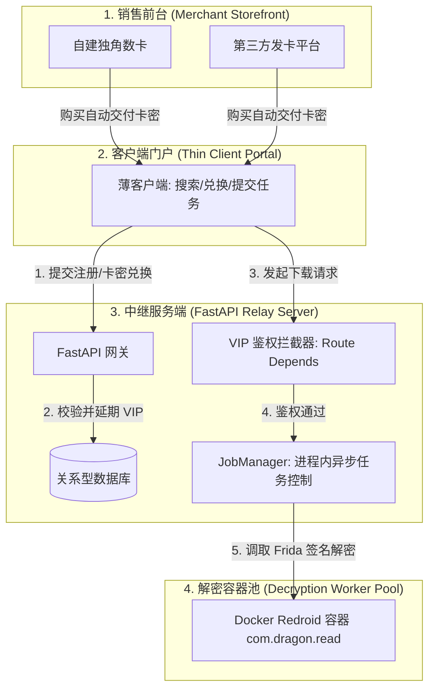
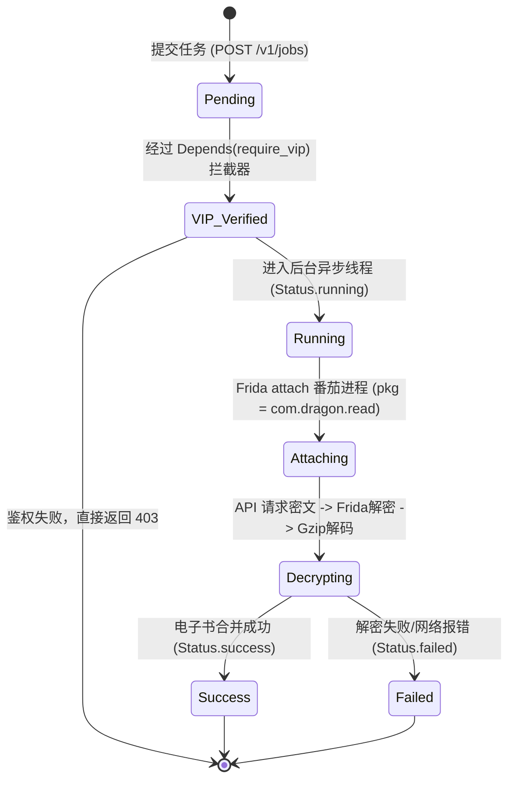

# 资源下载器全局商业化落地设计规范（中继网关/订阅卡密版）

> **⚠️ 本文为商业化阶段规划蓝图，尚未实施编码。**
>
> 对应迭代：**POST_MVP_PLAN 阶段 D**。  
> **可执行切片与迁移策略（D-0～D-4 顺序）以 [`docs/STAGE_D_PLAN.md`](./docs/STAGE_D_PLAN.md) 为准**；本文保留业务总览、表结构灵感与方案 B 鉴权示意。
>
> 架构决策见 [`DEVELOPMENT_PLAN.md`](./DEVELOPMENT_PLAN.md)；当前任务见 [`POST_MVP_PLAN.md`](./POST_MVP_PLAN.md)。
>
> 当前生产代码仍为 **X-API-Key**；`POST /v1/auth/redeem` 为 Stub。阶段 D 编码前不得在 UI 假装 VIP 已可用。

本规范详细定义了资源下载器向个人商业化过渡的系统架构、数据库实体、基于 **方案 B (路由级依赖注入)** 的统一鉴权方案，以及设备层（Redroid）部署规范。


## 1. 业务流程与架构总览 (System Architecture)

系统采用 **“薄客户端 + 托管中继”** 架构，将“前端交互、商品销售”与“核心签名解密”完全隔离。



---

## 2. 数据库建模与实体规范 (Database Design)

系统数据采用标准关系型数据库（推荐使用 SQLite 启动，生产环境平滑迁移至 PostgreSQL）。

### 2.1 物理表结构设计 (SQL DDL)
```sql
-- 用户主表 (储存登录凭证与 VIP 过期期限)
CREATE TABLE users (
    id INTEGER PRIMARY KEY AUTOINCREMENT,
    username VARCHAR(64) UNIQUE NOT NULL,
    hashed_password VARCHAR(256) NOT NULL,
    vip_expires_at TIMESTAMP NULL, -- 会员过期时间，NULL 或小于当前时间则为普通用户
    created_at TIMESTAMP DEFAULT CURRENT_TIMESTAMP,
    updated_at TIMESTAMP DEFAULT CURRENT_TIMESTAMP
);

-- 卡密库存表 (卡密预生成及核销记录)
CREATE TABLE card_keys (
    id INTEGER PRIMARY KEY AUTOINCREMENT,
    code VARCHAR(128) UNIQUE NOT NULL, -- 卡密序列号，如 VIP-30D-XXXX-XXXX
    duration_days INTEGER DEFAULT 30, -- 会员加成天数 (例如：30, 90, 365)
    is_used BOOLEAN DEFAULT 0, -- 是否已兑换核销
    used_by_username VARCHAR(64) NULL, -- 核销用户名
    used_at TIMESTAMP NULL, -- 核销时间
    created_at TIMESTAMP DEFAULT CURRENT_TIMESTAMP
);
```

### 2.2 卡密核销逻辑与防重入机制 (Redemption Code)
在兑换卡密时，利用数据库事务和**乐观锁/条件校验**，保证卡密不会被重复消费或产生并发竞争问题。

```python
# 兑换核销业务逻辑
from datetime import datetime, timezone, timedelta
from sqlalchemy.orm import Session

def execute_redeem(db: Session, username: str, card_code: str):
    # 开启悲观锁/行级锁，确保并发请求排队
    card = db.query(CardKey).filter(
        CardKey.code == card_code, 
        CardKey.is_used == False
    ).with_for_update().first()
    
    if not card:
        raise ValueError("卡密无效或已被他人兑换")
        
    user = db.query(User).filter(User.username == username).with_for_update().first()
    if not user:
        raise ValueError("用户不存在")
        
    # 状态转移
    now = datetime.now(timezone.utc)
    base_time = user.vip_expires_at if (user.vip_expires_at and user.vip_expires_at > now) else now
    
    # 写入消费记录
    card.is_used = True
    card.used_by_username = user.username
    card.used_at = now
    user.vip_expires_at = base_time + timedelta(days=card.duration_days)
    
    db.commit()
    return user.vip_expires_at
```

---

## 3. 统一鉴权拦截器设计 (Scheme B: Route-level Injection)

鉴于业务系统需要灵巧的权限控制（白名单开放登录/注册，下载模块严格要求 VIP），本系统完全采用 **方案 B (路由级依赖注入)** 作为安全拦截底座。

### 3.1 鉴权拦截器核心代码
在服务端的 `app/auth.py` 中，定义统一依赖层，实现 Token 解析和 VIP 状态的拦截判断。

```python
# server/app/auth.py
import jwt
from datetime import datetime, timezone
from fastapi import Depends, HTTPException, status
from fastapi.security import OAuth2PasswordBearer
from sqlalchemy.orm import Session
from app.database import get_db
from app.models import User

# 安全上下文入口 (拦截提取 Authorization: Bearer <token>)
oauth2_scheme = OAuth2PasswordBearer(tokenUrl="v1/auth/login")

# ⚠️ SECRET_KEY 必须从环境变量读取，严禁硬编码！
# SECRET_KEY = "COMMERCIAL_JWT_SECRET_SALT"  # ← 禁止
SECRET_KEY = os.environ["JWT_SECRET_KEY"]   # 生产: 随机 64+ 字符强密钥
ALGORITHM = "HS256"


async def get_current_user(token: str = Depends(oauth2_scheme), db: Session = Depends(get_db)) -> User:
    """拦截器 1：解析 Token，提取当前登录用户，不满足登录态返回 401"""
    credentials_exception = HTTPException(
        status_code=status.HTTP_401_UNAUTHORIZED,
        detail="未登录或登录状态已失效，请重新登录",
        headers={"WWW-Authenticate": "Bearer"},
    )
    try:
        payload = jwt.decode(token, SECRET_KEY, algorithms=[ALGORITHM])
        username: str = payload.get("sub")
        if username is None:
            raise credentials_exception
    except jwt.PyJWTError:
        raise credentials_exception
        
    user = db.query(User).filter(User.username == username).first()
    if user is None:
        raise credentials_exception
    return user


async def require_vip(current_user: User = Depends(get_current_user)) -> User:
    """拦截器 2：基于登录用户身份，校验 VIP 期限，不满足返回 403"""
    now = datetime.now()
    if not current_user.vip_expires_at or current_user.vip_expires_at < now:
        raise HTTPException(
            status_code=status.HTTP_403_FORBIDDEN,
            detail="当前功能为 VIP 会员专享，您的会员额度已过期或未激活，请前往发卡网购买卡密激活"
        )
    return current_user
```

### 3.2 路由层无缝拦截注入 (APRouter Integration)
在 `app/api/router.py` 中，对受保护的接口实施群组依赖拦截，简化每个函数内部的冗余校验。

```python
# server/app/api/router.py
from fastapi import APIRouter, Depends
from app.auth import get_current_user, require_vip
from app.models import JobCreateRequest

# 1. 开放路由组 (登录、注册、健康检查、卡密核销)
public_router = APIRouter(prefix="/v1/auth")

@public_router.post("/redeem")
async def redeem_code(body: RedeemRequest, db: Session = Depends(get_db)):
    # 允许普通登录用户进入，卡密核销在内部校验
    return execute_redeem(db, body.username, body.card_code)

# 2. 会员专属路由组 (下载任务、高级搜索)
# 挂载 require_vip 统一拦截器，自动拦截非 VIP 访问并输出 403
protected_jobs_router = APIRouter(
    prefix="/v1/jobs",
    dependencies=[Depends(require_vip)]  # 方案 B 的优雅实践
)

@protected_jobs_router.post("/")
async def create_download_job(request: JobCreateRequest, current_user: User = Depends(get_current_user)):
    # 当代码执行到这里时，require_vip 已成功拦截并确认了其 VIP 状态。
    # 我们可以拿到 current_user 实例记录任务归属
    return f"Job created for {current_user.username}"
```

---

## 4. 后端 Worker 进程内任务生命周期与防刷限流

为了不引入庞大的 Celery，系统保持在 `JobManager` 内部通过后台异步任务管理生命周期，同时配合 `slowapi` 或内存桶控制并发度。

### 4.1 任务生命周期状态图


### 4.2 API 防刷与限流 (Rate Limiting)
由于宿主机运行的番茄 App 并发量受限，对客户端用户的搜索和详情接口需挂载基于 IP/Token 的令牌桶限流。

```python
from slowapi import Limiter
from slowapi.util import get_remote_address

limiter = Limiter(key_func=get_remote_address)

# 限制单 IP 在 `/v1/search` 接口每分钟最多访问 5 次
@api_router.get("/v1/search")
@limiter.limit("5/minute")
async def search_novel(request: Request, q: str):
    pass
```

---

## 5. 解密容器化部署指引 (Docker Redroid Engine)

在云端（Linux x86_64 服务器）部署时，每个物理节点可运行数个独立 Redroid 镜像，作为签名与解密的后台实例。

### 5.1 启动 Redroid 容器 (Docker Run CLI)
```bash
# 启动支持软件渲染 (SwiftShader) 的安卓容器
docker run -d --privileged \
  --name redroid_fanqie_1 \
  -v ~/data/redroid1:/data \
  -p 5555:5555 \
  redroid/redroid:11.0.0-latest \
  androidboot.redroid_width=1080 \
  androidboot.redroid_height=1920 \
  androidboot.redroid_dpi=480 \
  androidboot.redroid_gpu_mode=guest
```

### 5.2 宿主机 ADB 与 Frida-server 注入
1.  **ADB 连通**：宿主机安装 ADB 工具，通过局域网连接红帽容器端口：`adb connect 127.0.0.1:5555`。
2.  **Frida-Server 伪装部署**：
    *   为了规避番茄 App 的反调试策略，将 `frida-server` 重命名为不包含 `frida` 字段的自定义进程名（如 `sys_hlpd`）。
    *   推送并以后台守护进程方式运行：
        ```bash
        adb push tools/setup/frida-server /data/local/tmp/sys_hlpd
        adb shell chmod 755 /data/local/tmp/sys_hlpd
        adb shell "/data/local/tmp/sys_hlpd -D &"
        ```
    *   在宿主机执行端口转发：`adb forward tcp:27042 tcp:27042`，使 Python 网关能够通过本地 `127.0.0.1:27042` 向安卓容器下发 Frida 脚本。
